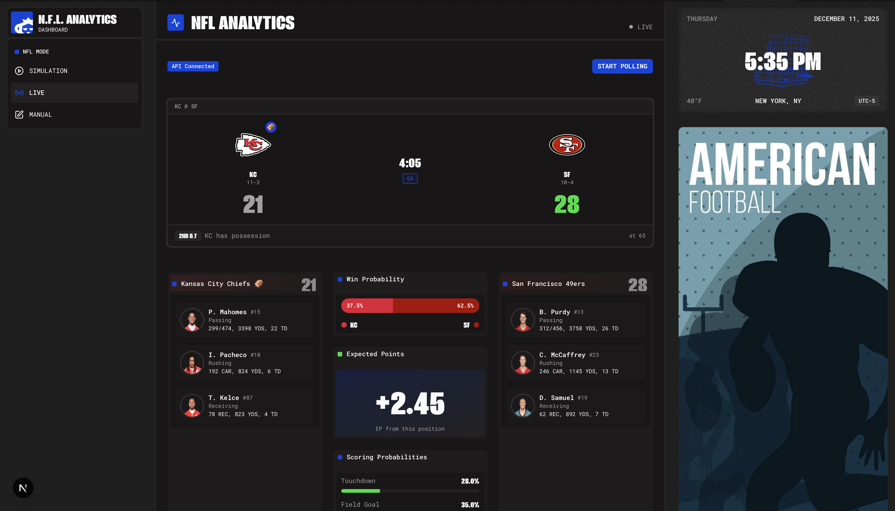

# 🏈 NFL Real-Time Analytics

Real-time NFL play prediction system using machine learning, AWS Kinesis streaming, and a React dashboard.



## 📊 Project Overview

This project provides real-time analytics for NFL games, including:
- **Expected Points (EP)** - Predicted points from current field position
- **Scoring Probability** - Chances of TD, FG, No Score, or opponent scoring
- **Play Type Prediction** - Run vs Pass classification
- **Pressure Prediction** - QB pressure risk assessment

## 🏗️ Architecture
┌─────────────────┐     ┌─────────────────┐     ┌─────────────────┐     ┌─────────────────┐
│  ESPN API /     │     │    AWS          │     │   FastAPI       │     │   React         │
│  Live Simulator │ ──▶ │   Kinesis       │ ──▶ │   API           │ ──▶ │   Dashboard     │
│                 │     │   Stream        │     │   + ML Models   │     │                 │
└─────────────────┘     └─────────────────┘     └─────────────────┘     └─────────────────┘

## 📈 Model Performance

| Model | Metric | Performance | Real-Time Ready |
|-------|--------|-------------|-----------------|
| Expected Points | R² | 99.5% | ✅ Yes |
| TD Probability | R² | 98.7% | ✅ Yes |
| FG Probability | R² | 98.3% | ✅ Yes |
| No Score Probability | R² | 99.2% | ✅ Yes |
| Play Classifier | Accuracy | 68.8% | ⚠️ Post-snap |
| Pressure Predictor | AUC-ROC | 61.1% | ⚠️ Post-snap |

**Training Data:** 9 NFL Seasons (2016-2024), ~310,000 plays

## 🚀 Quick Start

### Prerequisites
- Python 3.10+
- Node.js 18+
- AWS Account (for Kinesis)
- Docker (optional)

### Installation

1. **Clone the repository**
```bash
git clone https://github.com/gokulnpc/nfl-realtime-analytics.git
cd nfl-realtime-analytics
```

2. **Install Python dependencies**
```bash
pip install -r requirements.txt
```

3. **Install React dependencies**
```bash
cd frontend
npm install
cd ..
```

4. **Set up AWS credentials**
```bash
# Create .env file
cat > .env << EOL
AWS_ACCESS_KEY_ID=your_access_key
AWS_SECRET_ACCESS_KEY=your_secret_key
AWS_REGION=us-east-1
KINESIS_STREAM_NAME=nfl-play-stream
EOL
```

5. **Create Kinesis stream**
```bash
aws kinesis create-stream --stream-name nfl-play-stream --shard-count 1
```

### Running the Application

**Terminal 1 - Start API:**
```bash
python3 -m uvicorn src.api.main:app --reload --port 8000
```

**Terminal 2 - Start React Dashboard:**
```bash
cd frontend
npm start
```

**Terminal 3 - Run Live Demo Simulator:**
```bash
python3 src/simulator/live_demo.py
```

Then open http://localhost:3000 and click "🔴 Live Kinesis" to see real-time predictions!

### Using Docker
```bash
docker-compose up --build
```

- API: http://localhost:8000
- Dashboard: http://localhost:3000

## 📁 Project Structure
nfl-realtime-analytics/
├── src/
│   ├── api/                 # FastAPI backend
│   │   └── main.py
│   ├── ml/                  # Machine learning models
│   │   ├── expected_points.py
│   │   ├── scoring_probability.py
│   │   ├── play_classifier.py
│   │   └── pressure_predictor.py
│   ├── ingestion/           # Data ingestion
│   │   └── espn_poller.py
│   ├── streaming/           # Kinesis streaming
│   │   └── kinesis_producer.py
│   └── simulator/           # Demo simulator
│       └── live_demo.py
├── frontend/                # React dashboard
│   ├── src/
│   │   ├── App.js
│   │   └── App.css
│   └── package.json
├── models/                  # Trained ML models
│   ├── expected_points.joblib
│   ├── scoring_probability.joblib
│   ├── play_classifier.joblib
│   └── pressure_predictor.joblib
├── data/                    # Data directory
│   └── raw/                 # Raw play-by-play CSVs
├── docker-compose.yml
├── Dockerfile
├── requirements.txt
└── README.md

## 🔌 API Endpoints

| Endpoint | Method | Description |
|----------|--------|-------------|
| `/` | GET | API status |
| `/health` | GET | Health check with model status |
| `/predict` | POST | Get all predictions for a play |
| `/predict/expected-points` | POST | Expected points only |
| `/predict/scoring` | POST | Scoring probabilities only |
| `/predict/play-type` | POST | Play type prediction |
| `/predict/pressure` | POST | Pressure prediction |
| `/kinesis/status` | GET | Kinesis connection status |
| `/kinesis/fetch` | GET | Fetch plays from Kinesis |

### Example API Request
```bash
curl -X POST "http://localhost:8000/predict" \
  -H "Content-Type: application/json" \
  -d '{
    "down": 1,
    "ydstogo": 10,
    "yardline_100": 25,
    "qtr": 4,
    "half_seconds_remaining": 120,
    "score_differential": -4,
    "goal_to_go": 0
  }'
```

### Example Response
```json
{
  "expected_points": 4.77,
  "td_prob": 0.509,
  "fg_prob": 0.368,
  "no_score_prob": 0.12,
  "opp_td_prob": 0.003,
  "opp_fg_prob": 0.002,
  "safety_prob": 0.001,
  "opp_safety_prob": 0.0,
  "predicted_play": "short_pass",
  "run_probability": 0.003,
  "pass_probability": 0.997,
  "pressure_probability": 0.52,
  "pressure_risk": "high"
}
```

## 🎮 Dashboard Modes

1. **Manual Input** - Enter custom game situations
2. **Demo Mode** - Auto-cycling through sample plays
3. **Live Kinesis** - Real-time streaming from AWS Kinesis

## 📡 Live Game Integration

During actual NFL games, use the ESPN poller:
```bash
python3 src/ingestion/espn_poller.py --interval 30
```

This fetches live play data from ESPN and pushes to Kinesis.

## 🧪 Running Tests
```bash
cd src/tests
python3 test_ep_model.py
python3 test_scoring_prob_model.py
```

## 👥 Team

- **Adithyah Nair** - Data Engineering, ML Models, AWS Infrastructure
- **Gokul Nair** - Dashboard Development, API Integration
- **Aditya Maheshwari** - Expected Points & Scoring Probability Models
- **Sumisha** - Documentation & Final Report

## 📚 Data Sources

- [nfl_data_py](https://github.com/nflverse/nfl_data_py) - Play-by-play data
- [ESPN API](https://site.api.espn.com/apis/site/v2/sports/football/nfl) - Live game data

## 🛠️ Technologies

- **Backend:** Python, FastAPI, Uvicorn
- **Frontend:** React, CSS
- **ML:** XGBoost, scikit-learn, pandas
- **Streaming:** AWS Kinesis, PySpark
- **Infrastructure:** Docker, AWS

## 📄 License

MIT License

## 🙏 Acknowledgments

- NFL data provided by nflverse
- ESPN for live game API
- NYU Big Data Course (CS-GY-6513)
